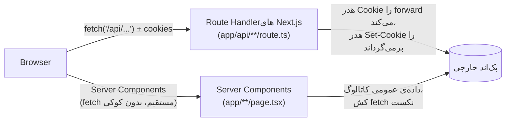
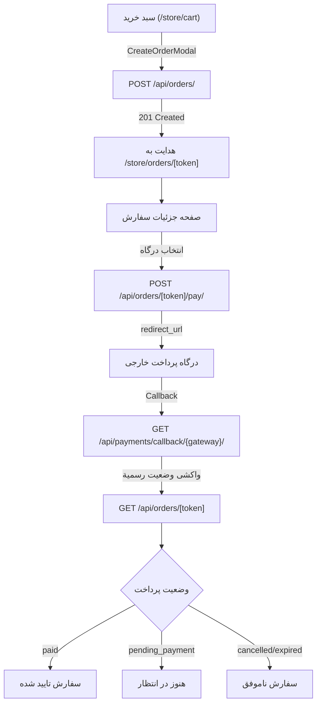

# آداجیو (Adagio) — معماری پروژه

> نسخه انگلیسی: [ARCHITECTURE.md](./ARCHITECTURE.md)

## ۱. نمای کلی

آداجیو فروشگاه آنلاینی برای یک برند استریت‌ویر است که با Next.js ساخته شده. این ریپازیتوری فقط **فرانت‌اند** است — یک بک‌اند جداگانه (که از طریق HTTP و بر پایه‌ی کوکی سشن و JSON به‌سبک DRF در دسترس است) مالک محصولات، کالکشن‌ها، سبد خرید، لیست علاقه‌مندی‌ها، آدرس‌ها، سفارش‌ها، پرداخت‌ها و احراز هویت با شماره موبایل/کد یک‌بارمصرف (OTP) است. کار فرانت‌اند نمایش، مسیریابی، مدیریت وضعیت سمت کلاینت (با React Query) و یک لایه‌ی پراکسی نازک هم‌مبدأ (same-origin) جلوی بک‌اند واقعی است.

رفتارهای کلیدی محصول که این معماری حول آن‌ها شکل گرفته:
- ورود با **شماره موبایل + کد یک‌بارمصرف** است، بدون رمز عبور.
- **سبد خرید و لیست علاقه‌مندی‌ها برای کاربران مهمان (guest) هم کار می‌کنند** — هویت آن‌ها یک کوکی صادرشده توسط بک‌اند است، نه نشست ورود.
- **گیت عضویت فقط در مرحله‌ی پرداخت تسویه‌حساب اعمال می‌شود** — مرحله‌ی جمع‌آوری اطلاعات برای مهمان‌ها هم در دسترس است.

## ۲. پشته‌ی فناوری (Tech Stack)

| لایه | انتخاب |
|---|---|
| فریم‌ورک | Next.js 15 (App Router)، React 19، TypeScript |
| استایل‌دهی | Tailwind CSS v4 |
| کامپوننت‌های پایه | shadcn/ui روی `@base-ui/react`، در `components/ui/*` |
| وضعیت سمت سرور | TanStack React Query نسخه ۵ |
| فرم‌ها | react-hook-form + zod |
| آیکون / انیمیشن | lucide-react، کتابخانه‌ی `motion` |
| فونت‌ها | فونت‌های فارسی/لاتین محلی در `app/fonts/` (وزیرمتن، یکان بخ، نستعلیق، Instrument Serif، Anton) |

## ۳. معماری کلی: الگوی پراکسی BFF



تمام ترافیک احراز هویت‌شده یا وابسته به وضعیت (auth، سبد خرید، لیست علاقه‌مندی‌ها، آدرس‌ها، استان/شهر) از مسیر Route Handlerهای هم‌مبدأ زیر `app/api/` عبور می‌کند که به `NEXT_PUBLIC_BACKEND_BASE_URL` (تعریف‌شده در `utils/getURL.ts`) پراکسی می‌شوند. دلیل وجود این لایه **دقیقاً کارکردن درست کوکی‌هاست**: کوکی‌های سشن/سبد خرید بک‌اند از نوع `SameSite=Lax` هستند و `fetch()` مرورگر به‌صورت cross-origin نمی‌تواند آن‌ها را به‌طور قابل‌اعتماد ارسال/دریافت کند. Route Handlerها هدر `cookie` ورودی را به بک‌اند forward می‌کنند و هر هدر `set-cookie` پاسخ را روی پاسخ Next.js کپی می‌کنند، تا از دید مرورگر همیشه کوکی هم‌مبدأ ست شود.

داده‌های عمومی و غیرشخصی‌سازی‌شده‌ی کاتالوگ (محصولات، کالکشن‌ها) از این پراکسی رد نمی‌شوند و **مستقیماً از داخل Server Componentها/توابع سرور** (`lib/store.ts`) از بک‌اند خوانده می‌شوند، با استفاده از کش fetch نکست (`next: { revalidate }`) به‌جای کوکی.

## ۴. ساختار پوشه‌ها

```
app/                    مسیرهای App Router (صفحات + Route Handlerهای API)
  api/                  مسیرهای پراکسی هم‌مبدأ به بک‌اند (بخش ۳)
    auth/               login, verify-otp, me, bootstrap, addresses, provinces/[id]/cities
    cart/                cart, cart/items/[sku]
    checkout/            gateways (لیست درگاه‌های پرداخت)
    orders/              orders (لیست، ایجاد), orders/[token] (جزئیات، آدرس، لغو، آیتم‌ها، پرداخت)
    wishlist/            wishlist, wishlist/items/[slug]
  store/, collections/, product/[slug]/   صفحات کاتالوگ (Server Components)
  store/orders/, store/orders/[token]/   لیست سفارش‌ها + جزئیات (کلاینت)
  orders/result/, orders/result/[token]/ صفحات نتیجه پرداخت (کلاینت)
  cart/, wishlist/, login/, about/, contact-me/   صفحات کلاینتی
components/            UI، دسته‌بندی‌شده بر اساس فیچر (Addresses/، Auth/، Orders/، ProductPage/، Wishlist/، Collection/) + components/ui (پرایمیتیوهای shadcn)
lib/                   لایه‌ی داده‌ی سمت کلاینت: یک فایل به‌ازای هر دامنه، هرکدام شامل
                         یک تابع fetch + هوک‌های React Query (cart.ts، wishlist.ts،
                         addresses.ts، locations.ts، store.ts، auth.ts، checkout.ts) + app-state.tsx،
                         providers.tsx، queryKeys.ts، utils.ts
hooks/                 هوک‌های عمومی (useMe، useMembership، useBootstrap، useSendPhone، useOrders)
services/              auth.service.ts، orders.service.ts — توابع API استفاده‌شده در hooks و lib/
types/                 تایپ‌های مشترک TypeScript، یک فایل به‌ازای هر دامنه، هم‌راستا با lib/
utils/getURL.ts        خواندن NEXT_PUBLIC_BACKEND_BASE_URL / _FRONTEND_BASE_URL
```

این الگو برای هر فیچر تکرار می‌شود: `types/<domain>.d.ts` (شکل داده) ← `lib/<domain>.ts` (fetch + هوک‌های React Query) ← `app/api/<domain>/route.ts` (پراکسی) ← `components/<Domain>/*` (رابط کاربری). هنگام کار روی یک فیچر، معمولاً هر چهار مورد باید تغییر کنند.

## ۵. نقشه‌ی مسیرها

| مسیر | رندر شده توسط | توضیح |
|---|---|---|
| `/` | `app/page.tsx` | صفحه‌ی اصلی |
| `/store`, `/store/collection/[slug]` | Server Components | لیست محصولات، فیلترها، صفحه‌بندی از طریق `lib/store.ts` |
| `/collections`, `/collections/[slug]` | Server Components | مرور کالکشن‌ها |
| `/product/[slug]` | Server Component + `ProductDetail` | صفحه‌ی جزئیات محصول |
| `/store/cart` | کلاینت | `CartView` ← `lib/cart.ts` + `CreateOrderModal` |
| `/store/orders` | کلاینت | لیست سفارش‌ها (صفحه‌بندی)، نیاز به عضویت |
| `/store/orders/[token]` | کلاینت | جزئیات سفارش + پرداخت، نیاز به عضویت |
| `/orders/result/[token]` | کلاینت | نتیجه پرداخت (موفق/ناموفق)، واکشی وضعیت رسمية سفارش |
| `/orders/result` | کلاینت | خطای عمومی پرداخت (بدون token) |
| `/wishlist` | کلاینت | `WishlistView`، پرامپت مهمان از طریق `WishlistLoginPrompt` |
| `/login`, `/login/[phonenumber]` | کلاینت | ورود شماره موبایل ← ورود کد OTP |
| `/about`, `/contact-me` | صفحات محتوای ثابت | |

| مسیر API | پراکسی به | استفاده‌شده در |
|---|---|---|
| `POST /api/auth/login` | ورود بک‌اند | `LoginForm` |
| `POST /api/auth/verify-otp` | تایید OTP بک‌اند | `OtpForm` |
| `GET /api/auth/me` | بررسی نشست بک‌اند | `hooks/useMe.ts` |
| `GET /api/auth/bootstrap` | ترکیب نشست+سبد خرید+علاقه‌مندی‌ها | `hooks/useBootstrap.ts` (تعریف‌شده، هنوز به Navbar وصل نشده) |
| `/api/auth/addresses`, `/api/auth/addresses/[id]` | CRUD آدرس | `lib/addresses.ts` |
| `/api/auth/provinces`, `/api/auth/provinces/[id]/cities` | داده‌ی مرجع مکانی | `lib/locations.ts` |
| `/api/cart`, `/api/cart/items`, `/api/cart/items/[sku]` | CRUD سبد خرید | `lib/cart.ts` |
| `/api/wishlist`, `/api/wishlist/items`, `/api/wishlist/items/[slug]` | CRUD لیست علاقه‌مندی‌ها | `lib/wishlist.ts` |
| `GET /api/orders`, `POST /api/orders` | لیست سفارش‌ها + ایجاد | `services/orders.service.ts` |
| `GET /api/orders/[token]` | جزئیات تک سفارش | `lib/checkout.ts` |
| `PATCH /api/orders/[token]/address` | بروزرسانی آدرس سفارش | `lib/checkout.ts` |
| `POST /api/orders/[token]/cancel` | لغو سفارش | `lib/checkout.ts` |
| `POST /api/orders/[token]/items` | افزودن آیتم سفارش | `lib/checkout.ts` |
| `PATCH /api/orders/[token]/items/[item_id]` | بروزرسانی تعداد آیتم | `lib/checkout.ts` |
| `DELETE /api/orders/[token]/items/[item_id]` | حذف آیتم سفارش | `lib/checkout.ts` |
| `POST /api/orders/[token]/pay` | آغاز پرداخت | `lib/checkout.ts` |
| `GET /api/checkout/gateways` | لیست درگاه‌های پرداخت | `lib/checkout.ts` |

## ۶. مدیریت وضعیت (State Management)

- **وضعیت سمت سرور** — TanStack Query مالک هر چیزی است که از بک‌اند می‌آید. هر دامنه در `lib/` توابع async ساده (`getCart`، `addCartItem`، …) به‌همراه هوک‌های `useX`/`useMutateX` متناظر export می‌کند؛ کلیدهای کوئری به‌صورت متمرکز در `lib/queryKeys.ts` نگه‌داری می‌شوند تا invalidation بین فایل‌ها سازگار بماند. `lib/providers.tsx` تنظیمات غیرپیش‌فرض عمدی برای `QueryClient` دارد (`retry: 1`، `staleTime: 30_000`، `refetchOnWindowFocus: false`) — مقادیر پیش‌فرض کتابخانه باعث تلاش مجدد چندباره روی خطاهای گذرا و refetch در هر ناوبری برای سبد خرید/علاقه‌مندی‌ها می‌شد.
- **وضعیت UI سمت کلاینت** — یک Context واحد در React به نام `AppStateProvider` (`lib/app-state.tsx`)، که فعلاً فقط برای نوتیفیکیشن toast استفاده می‌شود. هیچ store سراسری به‌سبک Redux/Zustand وجود ندارد؛ برنامه تا حد امکان روی کش React Query به‌عنوان منبع حقیقت تکیه می‌کند.
- **فرم‌ها** — react-hook-form همراه با اسکیمای zod، تعریف‌شده کنار هر کامپوننت فرم.

## ۷. سفارش‌ها و پرداخت

سفارش‌ها از سبد خرید ایجاد و از طریق صفحه جزئیات سفارش مدیریت می‌شوند. جریان پرداخت گیت‌دار عضویت است و به درگاه پرداخت خارجی هدایت می‌شود.



**جریان داده:** `UI → hooks (lib/checkout.ts) → service (services/orders.service.ts) → API Route Handlers (app/api/orders/**) → Backend`

**رفتارهای کلیدی:**
- ایجاد سفارش سبد خرید فعال را به سفارش تبدیل می‌کند؛ سبد خرید بعد از ایجاد invalidate می‌شود.
- لیست سفارش‌ها (`/store/orders`) به‌صورت صفحه‌بندی شده از طریق `PaginatedResponse<Order>` است.
- جزئیات سفارش (`/store/orders/[token]`) خلاصه سفارش، آیتم‌ها، آدرس و عملیات پرداخت را نمایش می‌دهد.
- انتخاب درگاه پرداخت فقط از فیلدهای `PaymentGateway` استفاده می‌کند (`id`، `title`، `badge`، `description`، `min_amount`، `max_amount`). هیچ اعتبار (credential) لو داده نمی‌شود.
- اولین درگاه موجود به‌صورت پیش‌فرض در `PaymentAction` انتخاب می‌شود.
- پس از هدایت پرداخت، کال‌بک بک‌اند وضعیت رسمی سفارش را تعیین می‌کند — فرانت‌اند هرگز به پارامتر query اعتماد نمی‌کند.
- صفحات نتیجه پرداخت (`/orders/result/[token]`، `/orders/result`) سفارش را از بک‌اند واکشی می‌کنند تا وضعیت واقعی را نمایش دهند.
- مقادیر `OrderStatus`: `pending_payment`، `paid`، `cancelled`، `expired`.

### ۷.۱ جریان کامل پرداخت

```text
/store/cart
→ "ادامه فرآیند خرید"
→ CreateOrderModal (یادداشت سفارش اختیاری)
→ POST /api/orders/ { address_id, customer_note }
→ سفارش ایجاد شد (سبد خرید invalidate شد)
→ هدایت به /store/orders/[token]
→ OrderDetail رندر می‌کند PaymentAction
→ GET /api/checkout/gateways/ (درگاه‌ها بارگذاری شدند)
→ اولین درگاه به‌صورت خودکار انتخاب شد
→ کاربر روی "پرداخت" کلیک کرد
→ POST /api/orders/[token]/pay/ { gateway_id }
→ بک‌اند redirect_url برگرداند
→ window.location.href = redirect_url (redirect کامل مرورگر)
→ درگاه پرداخت خارجی
→ کال‌بک بک‌اند (GET /api/payments/callback/{gateway}/)
→ بک‌اند وضعیت سفارش را به‌روزرسانی کرد
→ هدایت به /orders/[token]/result?status=success|failed
   یا /orders/result?status=error (بدون token)
→ صفحه نتیجه GET /api/orders/[token] را واکشی کرد (رسمی)
→ نمایش وضعیت سفارش از بک‌اند (paid/pending_payment/cancelled/expired)
```

## ۸. احراز هویت و عضویت

ورود با شماره موبایل + کد یک‌بارمصرف است، بدون رمز عبور. جریان کار: `components/Auth/LoginForm.tsx` شماره موبایل را می‌گیرد و از طریق `app/api/auth/login/route.ts` (پراکسی) ارسال می‌کند؛ کاربر به `/login/[phonenumber]` می‌رود، جایی که `components/Auth/OtpForm.tsx` کد ۵رقمی را می‌گیرد و از طریق `app/api/auth/verify-otp/route.ts` تایید می‌کند. تمام مسیرهای `app/api/auth/*` پراکسی‌های نازک سمت سرور هستند (بخش ۳) — دلیل وجودشان این است که کوکی نشست بک‌اند بتواند هم‌مبدأ ست شود.

**بررسی وضعیت عضویت:** از `useMembership()` (`hooks/useMembership.ts`) استفاده کنید — تنها جایی در برنامه که باید پاسخ دهد «آیا این بازدیدکننده یک عضو ثبت‌نام‌شده است یا مهمان». این هوک، `useMe()` (`hooks/useMe.ts` ← تابع `getMe()` در `services/auth.service.ts` ← `GET /api/auth/me`) را در خود می‌پیچد و این خروجی را ارائه می‌دهد:

```ts
const { user, isMember, isGuest, isLoading, isError } = useMembership();
```

این هوک به‌شکل **fail-closed** عمل می‌کند: `isMember` فقط زمانی `true` است که کاربر با موفقیت تایید شده باشد — بررسی در حال بارگذاری یا با خطا، برای هر تصمیم گیت‌بندی مثل «مهمان» در نظر گرفته می‌شود، بنابراین شبکه‌ی کند یا مشکل موقت بک‌اند هرگز نمی‌تواند دسترسی مخصوص عضو را اعطا کند. هر منطق جدید وابسته به عضویت باید از طریق `useMembership()` انجام شود، نه یک فراخوانی مستقیم و جدید به `useMe()`.

**دسترسی مهمان در مقابل عضو:**
- سبد خرید (`/cart`، `lib/cart.ts`، `app/api/cart/*`) کاملاً برای مهمان‌ها کار می‌کند — هویت سبد خرید یک کوکی صادرشده توسط بک‌اند است و ربطی به وضعیت ورود ندارد.
- تسویه‌حساب (`components/CheckoutModal.tsx`) برای همه باز است؛ مرحله‌ی جمع‌آوری اطلاعات آن برای مهمان هم در دسترس است. فقط مرحله‌ی پرداخت گیت‌بندی شده و از طریق `useMembership()` بررسی می‌شود.
- بعد از تایید موفق OTP، `OtpForm.tsx` هر دو کوئری عضویت و سبد خرید را invalidate می‌کند تا UI بلافاصله وضعیت جدید ورود را نشان دهد، بدون نیاز به منتظرماندن برای منقضی‌شدن staleness کش `useMe()`.

## ۹. قرارداد مرز داده (Data Boundary)

به JSON دریافتی از بیرون فقط تا مرز ماژول اعتماد می‌شود. جایی که مشاهده شده پاسخ بک‌اند بین اندپوینت‌های مختلف در شکل داده تفاوت دارد (مثلاً یک فیلد مرتبط در یک پاسخ به‌صورت شناسه‌ی ساده و در پاسخ دیگر به‌صورت آبجکت تودرتوی `{id, name}` برگردانده می‌شود)، تابع fetch همان دامنه شکل داده را یک‌بار نرمال‌سازی می‌کند — پیش از آنکه به کامپوننت یا کش React Query برسد — به‌جای دفاع در برابر آن در هر نقطه‌ی مصرف. برای نمونه‌ی فعلی به `normalizeAddress()`/`toId()` در `lib/addresses.ts` نگاه کنید (فیلدهای استان/شهر).

## ۱۰. متغیرهای محیطی

| متغیر | کاربرد |
|---|---|
| `NEXT_PUBLIC_BACKEND_BASE_URL` | آدرس پایه‌ی بک‌اند خارجی؛ استفاده‌شده در `utils/getURL.ts` (مقصد پراکسی سمت سرور) و `next.config.ts` (میزبان مجاز تصویر) |
| `NEXT_PUBLIC_FRONTEND_BASE_URL` | آدرس پایه‌ی خودِ این برنامه، در کنار آدرس بک‌اند export می‌شود برای کدی که نیاز به ساخت لینک مطلق به خودش دارد |

## ۱۱. مدیریت خطا و امنیت

**بررسی‌های رسمی بک‌اند:**
- مجوزدهی و مالکیت سفارش
- وضعیت پرداخت (فرانت‌اند هرگز به پارامترهای query اعتماد نمی‌کند)
- وضعیت قابل‌پرداخت بودن سفارش (`is_payable`، `is_expired`)
- اعتبار درگاه (فقط درگاه‌های فعال برگردانده می‌شوند)

**فرانت‌اند مدیریت می‌کند:**
- 400 (خطاهای اعتبارسنجی) → toast با پیام بک‌اند
- 401 (غیرمجاز) → به عنوان مهمان در نظر گرفته می‌شود، گیت عضویت از طریق `useMembership()`
- 404 (سفارش یافت نشد) → حالت خطا با دکمه تلاش دوباره
- خرابی شبکه → toast، دکمه‌های تلاش دوباره
- سفارش‌های منقضی شده (`is_expired`) → UI پرداخت غیرفعال با پیام
- درگاه‌های غیرفعال → «درگاه پرداختی فعال نیست»
- شکست پرداخت → toast با خطای بک‌اند، ماندن در جزئیات سفارش
- پاسخ‌های غیرمنتظره → پیام‌های پیش‌فرض عمومی

**امنیت:**
- هیچ اعتبار درگاهی به فرانت‌اند لو داده نمی‌شود
- هیچ اعتبار پرداخت/نشست در ذخیره‌سازی مرورگر نگهداری نمی‌شود
- Redirect کامل مرورگر (`window.location.href`) برای درگاه خارجی
- توکن CSRF برای آغاز پرداخت forward می‌شود
- تمام درخواست‌های Stateful از طریق پراکسی هم‌مبدأ با forward کردن کوکی

## ۱۲. نقاط ناتمام شناخته‌شده

- `hooks/useBootstrap.ts` / `GET /api/auth/bootstrap` نشست + تعداد سبد خرید + تعداد لیست علاقه‌مندی‌ها را در یک فراخوانی ترکیب می‌کند، اما فعلاً چیزی از این هوک استفاده نمی‌کند — Navbar/MobileBottomNav هنوز فراخوانی‌های جداگانه دارند. وصل‌کردن آن یک درخواست به‌ازای هر ناوبری را حذف می‌کند.