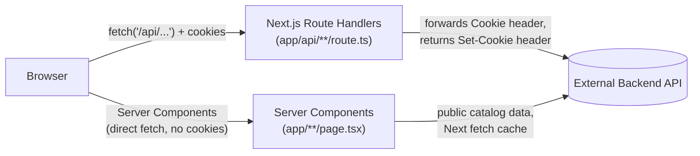
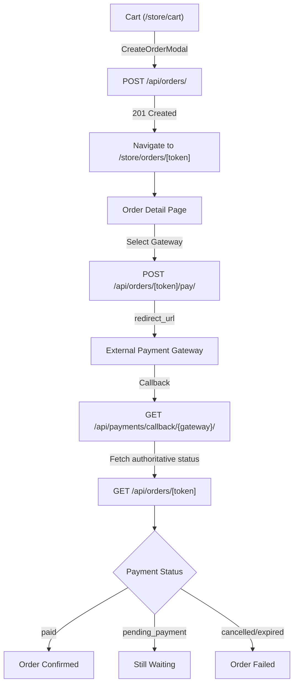

# Adagio — Architecture

> Persian/Farsi version: [ARCHITECTURE.fa.md](./ARCHITECTURE.fa.md)

## 1. Overview

Adagio is a Next.js storefront for a streetwear brand. This repository is the **frontend only** — a separate backend (accessed over HTTP, session-cookie based, DRF-style JSON) owns products, collections, cart, wishlist, addresses, orders, payments, and phone/OTP authentication. The frontend's job is presentation, routing, client-side state (via React Query), and a thin same-origin proxy layer in front of the real backend.

Key product behaviors that shape the architecture:
- Login is **phone number + OTP**, no password.
- The **cart and wishlist work for guests** — identity is a backend-issued cookie, not a login session.
- **Checkout is member-gated only at the payment step** — the info-collection step stays guest-accessible.

## 2. Tech Stack

| Layer | Choice |
|---|---|
| Framework | Next.js 15 (App Router), React 19, TypeScript |
| Styling | Tailwind CSS v4 |
| UI primitives | shadcn/ui components on top of `@base-ui/react`, `components/ui/*` |
| Server state | TanStack React Query v5 |
| Forms | react-hook-form + zod |
| Icons / motion | lucide-react, `motion` |
| Fonts | Local Farsi/Latin webfonts under `app/fonts/` (Yekan Bakh, Nastaliq, Instrument Serif, Anton) |

## 3. High-Level Architecture: BFF Proxy Pattern



All authenticated or stateful traffic (auth, cart, wishlist, addresses, locations) goes through same-origin Route Handlers under `app/api/`, which proxy to `NEXT_PUBLIC_BACKEND_BASE_URL` (`utils/getURL.ts`). This exists **specifically to make cookies work**: the backend's session/cart cookies are `SameSite=Lax`, which cross-origin `fetch()` from the browser can't reliably send/receive. Route Handlers forward the incoming `cookie` header to the backend and copy any `set-cookie` response header back onto the Next.js response, so the cookie is always set same-origin from the browser's point of view.

Public, non-personalized catalog data (products, collections) skips this proxy and is fetched **directly from the backend inside Server Components / server functions** (`lib/store.ts`), using Next.js's fetch cache (`next: { revalidate }`) instead of cookies.

## 4. Directory Structure

```
app/                    App Router routes (pages + API route handlers)
  api/                  Same-origin proxy routes to the backend (see §3)
    auth/               login, verify-otp, me, bootstrap, addresses, provinces/[id]/cities
    cart/                cart, cart/items/[sku]
    checkout/            gateways (payment gateway list)
    orders/              orders (list, create), orders/[token] (detail, address, cancel, items, pay)
    wishlist/            wishlist, wishlist/items/[slug]
  store/, collections/, product/[slug]/   catalog pages (Server Components)
  store/orders/, store/orders/[token]/   order list + detail pages (client)
  orders/result/, orders/result/[token]/ payment result pages (client)
  cart/, wishlist/, login/, about/, contact-me/   client-facing pages
components/            UI, grouped by feature (Addresses/, Auth/, Orders/, ProductPage/, Wishlist/, Collection/) + components/ui (shadcn primitives)
lib/                   Client-side data layer: one file per domain, each exporting
                         a fetch function + React Query hooks (cart.ts, wishlist.ts,
                         addresses.ts, locations.ts, store.ts, auth.ts, checkout.ts) + app-state.tsx,
                         providers.tsx, queryKeys.ts, utils.ts
hooks/                 Cross-cutting hooks (useMe, useMembership, useBootstrap, useSendPhone, useOrders)
services/              auth.service.ts, orders.service.ts — API functions used by hooks and lib/
types/                 Shared TypeScript types, one file per domain, mirroring lib/
utils/getURL.ts        Reads NEXT_PUBLIC_BACKEND_BASE_URL / _FRONTEND_BASE_URL
```

The pattern repeats per feature: `types/<domain>.d.ts` (shape) → `lib/<domain>.ts` (fetch + React Query hooks) → `app/api/<domain>/route.ts` (proxy) → `components/<Domain>/*` (UI). When working on a feature, expect to touch all four.

## 5. Routing Map

| Route | Renders | Notes |
|---|---|---|
| `/` | `app/page.tsx` | Home |
| `/store`, `/store/collection/[slug]` | Server Components | Product listing, filters, pagination via `lib/store.ts` |
| `/collections`, `/collections/[slug]` | Server Components | Collection browsing |
| `/product/[slug]` | Server Component + `ProductDetail` | Product detail page |
| `/store/cart` | Client | `CartView` → `lib/cart.ts` + `CreateOrderModal` |
| `/store/orders` | Client | Order list (paginated), requires membership |
| `/store/orders/[token]` | Client | Order detail + payment, requires membership |
| `/orders/result/[token]` | Client | Payment result (success/failed), fetches authoritative order status |
| `/orders/result` | Client | Generic payment error (no token) |
| `/wishlist` | Client | `WishlistView`, guest prompt via `WishlistLoginPrompt` |
| `/login`, `/login/[phonenumber]` | Client | Phone entry → OTP entry |
| `/about`, `/contact-me` | Static content pages | |

| API route | Proxies to | Used by |
|---|---|---|
| `POST /api/auth/login` | backend login | `LoginForm` |
| `POST /api/auth/verify-otp` | backend OTP verify | `OtpForm` |
| `GET /api/auth/me` | backend session check | `hooks/useMe.ts` |
| `GET /api/auth/bootstrap` | combined session+cart+wishlist | `hooks/useBootstrap.ts` (defined, not yet wired into Navbar) |
| `/api/auth/addresses`, `/api/auth/addresses/[id]` | address CRUD | `lib/addresses.ts` |
| `/api/auth/provinces`, `/api/auth/provinces/[id]/cities` | location reference data | `lib/locations.ts` |
| `/api/cart`, `/api/cart/items`, `/api/cart/items/[sku]` | cart CRUD | `lib/cart.ts` |
| `/api/wishlist`, `/api/wishlist/items`, `/api/wishlist/items/[slug]` | wishlist CRUD | `lib/wishlist.ts` |
| `GET /api/orders`, `POST /api/orders` | order list + create | `services/orders.service.ts` |
| `GET /api/orders/[token]` | single order detail | `lib/checkout.ts` |
| `PATCH /api/orders/[token]/address` | update order address | `lib/checkout.ts` |
| `POST /api/orders/[token]/cancel` | cancel order | `lib/checkout.ts` |
| `POST /api/orders/[token]/items` | add order item | `lib/checkout.ts` |
| `PATCH /api/orders/[token]/items/[item_id]` | update order item qty | `lib/checkout.ts` |
| `DELETE /api/orders/[token]/items/[item_id]` | remove order item | `lib/checkout.ts` |
| `POST /api/orders/[token]/pay` | initiate payment | `lib/checkout.ts` |
| `GET /api/checkout/gateways` | list payment gateways | `lib/checkout.ts` |

## 6. State Management

- **Server state** — TanStack Query owns everything that comes from the backend. Each domain in `lib/` exports plain async functions (`getCart`, `addCartItem`, …) plus paired `useX`/`useMutateX` hooks; query keys are centralized in `lib/queryKeys.ts` so invalidation stays consistent across files. `lib/providers.tsx` sets deliberately non-default `QueryClient` options (`retry: 1`, `staleTime: 30_000`, `refetchOnWindowFocus: false`) — the factory defaults were causing multi-attempt retries on transient errors and refetch-on-every-navigation for cart/wishlist.
- **Client UI state** — a single React Context, `AppStateProvider` (`lib/app-state.tsx`), currently scoped to the toast notification. There is no Redux/Zustand-style global store; the app leans on React Query's cache as the source of truth wherever possible.
- **Forms** — react-hook-form + zod schemas defined alongside each form component.

## 7. Orders & Payment

Orders are created from the cart and managed through the order detail page. The payment flow is member-gated and redirects to an external payment gateway.



**Data flow:** `UI → hooks (lib/checkout.ts) → service (services/orders.service.ts) → API Route Handlers (app/api/orders/**) → Backend`

**Key behaviors:**
- Order creation converts the active cart into an order; the cart is invalidated after creation.
- Order list (`/store/orders`) is paginated via `PaginatedResponse<Order>`.
- Order detail (`/store/orders/[token]`) shows order summary, items, address, and payment action.
- Payment gateway selection uses `PaymentGateway` fields only (`id`, `title`, `badge`, `description`, `min_amount`, `max_amount`). No credentials are exposed.
- The first available gateway is auto-selected by default in `PaymentAction`.
- After payment redirect, the backend callback determines the authoritative order status — the frontend never trusts a query parameter.
- Payment result pages (`/orders/result/[token]`, `/orders/result`) fetch the order from the backend to display the true status.
- `OrderStatus` values: `pending_payment`, `paid`, `cancelled`, `expired`.

### 7.1 Complete Payment Flow

```text
/store/cart
→ "ادامه فرآیند خرید"
→ CreateOrderModal (optional customer_note)
→ POST /api/orders/ { address_id, customer_note }
→ Order created (cart invalidated)
→ Navigate to /store/orders/[token]
→ OrderDetail renders PaymentAction
→ GET /api/checkout/gateways/ (gateways loaded)
→ First gateway auto-selected
→ User clicks "پرداخت"
→ POST /api/orders/[token]/pay/ { gateway_id }
→ Backend returns redirect_url
→ window.location.href = redirect_url (full browser redirect)
→ External Payment Gateway
→ Backend callback (GET /api/payments/callback/{gateway}/)
→ Backend updates order status
→ Redirect to /orders/[token]/result?status=success|failed
   OR /orders/result?status=error (no token)
→ Result page fetches GET /api/orders/[token] (authoritative)
→ Display order status from backend (paid/pending_payment/cancelled/expired)
```

## 8. Authentication & Membership

Login is phone number + OTP, no password. Flow: `components/Auth/LoginForm.tsx` collects a phone number and posts it via `app/api/auth/login/route.ts` (proxy); the user lands on `/login/[phonenumber]`, where `components/Auth/OtpForm.tsx` collects the 5-digit code and verifies it via `app/api/auth/verify-otp/route.ts`. All `app/api/auth/*` routes are thin server-side proxies (see §3) — they exist so the backend's session cookie can be set same-origin.

**Checking membership status:** use `useMembership()` (`hooks/useMembership.ts`) — the single place in the app that should ever answer "is this visitor a registered member or a guest." It wraps `useMe()` (`hooks/useMe.ts` → `services/auth.service.ts`'s `getMe()` → `GET /api/auth/me`) and exposes:

```ts
const { user, isMember, isGuest, isLoading, isError } = useMembership();
```

It **fails closed**: `isMember` is only ever `true` once a user is successfully confirmed — a loading or errored check is treated the same as "guest" for any gating decision, so a slow network or backend hiccup can never grant member-only access. New membership-dependent logic should go through `useMembership()`, not a fresh call to `useMe()`.

**Guest vs. member access:**
- The cart (`/cart`, `lib/cart.ts`, `app/api/cart/*`) works fully for guests — cart identity is a backend-issued cookie, unrelated to login state.
- Checkout (`components/CheckoutModal.tsx`) opens for everyone; its info-collection step is guest-accessible. Only the payment step is gated, checked via `useMembership()`.
- On successful OTP verification, `OtpForm.tsx` invalidates both the membership and cart queries so the UI reflects the new signed-in state immediately, without waiting out `useMe()`'s cache staleness.

## 9. Data Boundary Convention

External JSON is trusted only up to the module boundary. Where backend responses have been observed to vary in shape between endpoints (e.g. a related field returned as a plain id in one response and as a nested `{id, name}` object in another), the fetch function for that domain normalizes the shape once — before it ever reaches a component or a React Query cache entry — rather than defending against it at every call site. See `lib/addresses.ts`'s `normalizeAddress()`/`toId()` for the current example (province/city fields).

## 10. Environment Variables

| Variable | Purpose |
|---|---|
| `NEXT_PUBLIC_BACKEND_BASE_URL` | Base URL of the external backend; used by `utils/getURL.ts` (server-side proxy target) and `next.config.ts` (allowed image host) |
| `NEXT_PUBLIC_FRONTEND_BASE_URL` | This app's own base URL, exported alongside the backend URL for code that needs to build absolute links back to itself |

## 11. Error Handling & Security

**Backend-authoritative checks:**
- Authorization & order ownership
- Payment status (frontend never trusts query params)
- Order payable state (`is_payable`, `is_expired`)
- Gateway validity (only active gateways returned)

**Frontend handles:**
- 400 (validation errors) → toast with backend message
- 401 (unauthorized) → treated as guest, membership gating via `useMembership()`
- 404 (order not found) → error state with retry
- Network failures → toast, retry buttons
- Expired orders (`is_expired`) → disabled payment UI with message
- Unavailable gateways → "درگاه پرداختی فعال نیست"
- Payment failures → toast with backend error, stay on order detail
- Unexpected responses → generic fallback messages

**Security:**
- No gateway credentials exposed to frontend
- No payment/session credentials in browser storage
- Full browser redirect (`window.location.href`) for external gateway
- CSRF token forwarded for payment initiation
- All stateful requests go through same-origin proxy with cookie forwarding

## 12. Known Gaps

- `hooks/useBootstrap.ts` / `GET /api/auth/bootstrap` combine session + cart count + wishlist count in one call, but nothing currently consumes the hook — Navbar/MobileBottomNav still make separate calls. Wiring it in would cut a request-per-navigation.